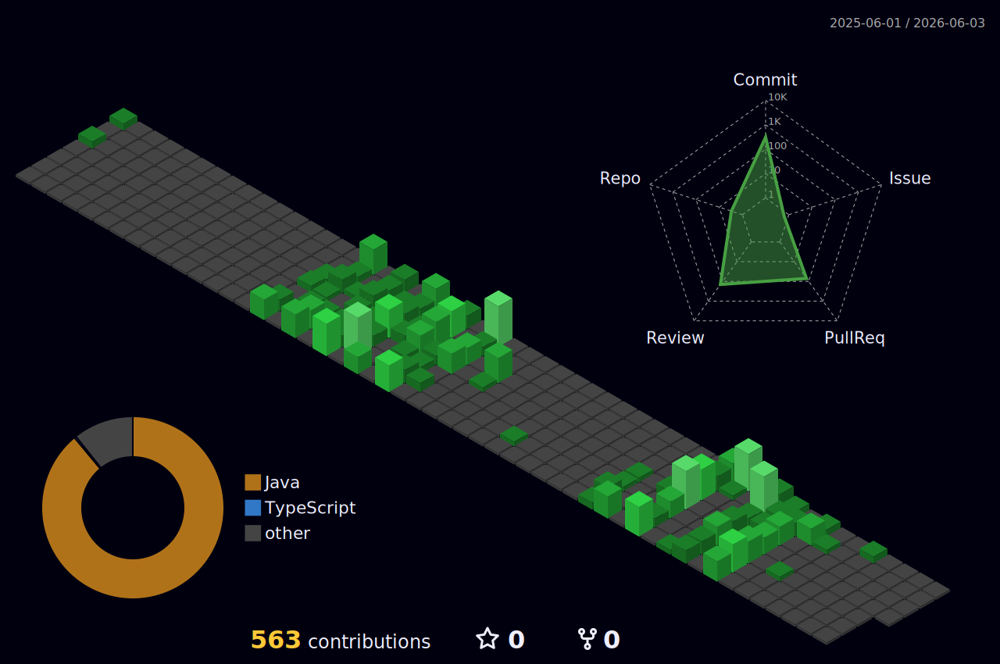

## Hey 👋, I'm Wilson! Welcome to my GitHub page.

My name is Wilson Chen (he/him), and I am a current undergraduate attending Quinnipiac University, pursuing the 3+1 Dual-Degree Program in Computer Science and Cybersecurity. I love to continuously learn programming, computer networking, and fiddle with electronics.

  
<h2>What I Use + Currently Learning</h2>

  <table width="100%">
    <tr>
      <th>Languages & Tools</th>
      <th>Currently Learning</th>
    </tr>

  <tr>
    <td align="center">
       

        
        
        
        
      

    </td>

  <td align="center">
     

       
       
        

      </td>
    </tr>
  </table>

## I'm currently working on:
#### Creating and Deploying a QU Microservices Cluster with three peers in my Computer Networking Class.
- We're applying our understanding of Computer Networking + Internet Protocols to build a microservice cluster hosted on 6 AWS EC2 instances.
- Link: https://github.com/WilsonC67/CSC340Project1
#### Developing a cross-platform Stress Predictor with Hunter Pageau (https://github.com/ThisIsHP64) as Undergraduate Research Assistants. 
- To be used in a ML research study exploring the relationship between Screen Time and magnitude of stress.
- Link: https://github.com/WilsonC67/StressFormiOS

## Check out some of the projects I've recently finished! 
#### Hive Heroes: A 2D Bee Conquest Game made in my Software Development (SER225) Class!
- I practiced using the Agile Software Development Lifecycle with three classmates and an upperclassman Scrum Master.
- The link is: https://github.com/ThisIsHP64/hive-heroes

#### HackathonResumeBuilder: An AI Integrated Resume Builder for the QU Fall 2025 Hackathon.
- Along with three other peers, we created a user-friendly JavaFX frontend integrated with Google Gemini to facilitate resume building.
- Link: https://github.com/ChrisF132/HackathonResumeBuilder

## Connect With Me!
- LinkedIn: https://www.linkedin.com/in/wilsonc2006/

  
<h2>My Stats and Activity</h2>

  

    
    
  
 
  
  

      
  

  

  <picture>
    <source media="(prefers-color-scheme: dark)" 
      srcset="https://raw.githubusercontent.com/WilsonC67/WilsonC67/output/github-snake-dark.svg">
    <source media="(prefers-color-scheme: light)" 
      srcset="https://raw.githubusercontent.com/WilsonC67/WilsonC67/output/github-snake.svg">
    
  </picture>

Cool Open Source Projects Used to Rice this README:
- Dynamic Line Typing: https://github.com/DenverCoder1/readme-typing-svg
- README Stats: https://github.com/anuraghazra/github-readme-stats
- 3D Commit Graph: https://github.com/yoshi389111/github-profile-3d-contrib
- Snake Animation: https://github.com/Platane/snk

<!--
**WilsonC67/WilsonC67** is a ✨ _special_ ✨ repository because its `README.md` (this file) appears on your GitHub profile.

Here are some ideas to get you started:
To add: 

- 🔭 I’m currently working on ...
- 🌱 I’m currently learning ...
- 👯 I’m looking to collaborate on ...
- 🤔 I’m looking for help with ...
- 💬 Ask me about ...
- 📫 How to reach me: ...
- 😄 Pronouns: ...
- ⚡ Fun fact: ...
-->
